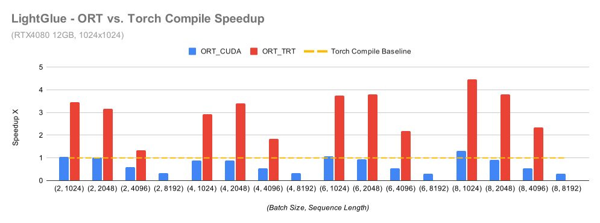
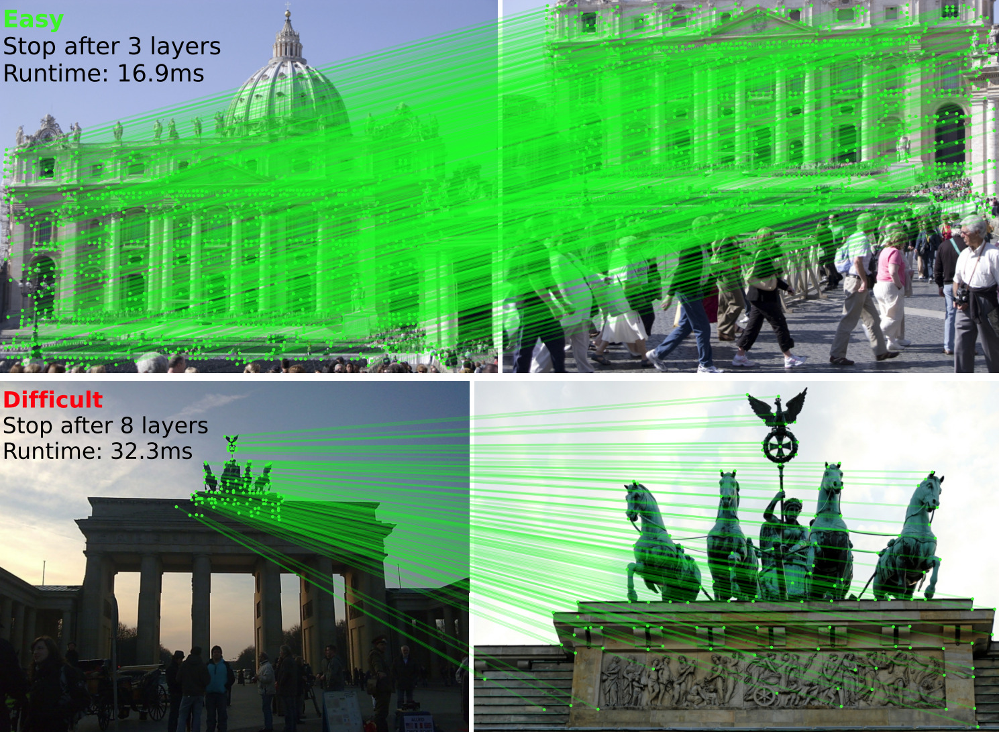

<div align="right"> English | <a href="https://github.com/fabio-sim/LightGlue-ONNX/blob/main/docs/README.zh.md">简体中文</a> | <a href="https://github.com/fabio-sim/LightGlue-ONNX/blob/main/docs/README.ja.md">日本語</a></div>

[](https://onnx.ai/)
[](https://developer.nvidia.com/tensorrt)
[](https://github.com/fabio-sim/LightGlue-ONNX/stargazers)
[](https://github.com/fabio-sim/LightGlue-ONNX/releases)
[](https://fabio-sim.github.io)

# LightGlue ONNX

Open Neural Network Exchange (ONNX) compatible implementation of [LightGlue: Local Feature Matching at Light Speed](https://github.com/cvg/LightGlue). The ONNX model format allows for interoperability across different platforms with support for multiple execution providers, and removes Python-specific dependencies such as PyTorch. Supports TensorRT and OpenVINO. [Detailed write-up](https://fabio-sim.github.io).

> ✨ ***What's New***: FP8 Quantization Workflow. Read more in this [blog post](https://fabio-sim.github.io/blog/fp8-quantized-lightglue-tensorrt-nvidia-model-optimizer/).

<p align="center"><a href="https://fabio-sim.github.io/blog/accelerating-lightglue-inference-onnx-runtime-tensorrt/"></a><br><em>⏱️ Inference Time Comparison</em></p>

<p align="center"><a href="https://arxiv.org/abs/2306.13643"></a></p>

**19 January 2026**: Add FP8 quantization workflow (ModelOpt Q/DQ export and TensorRT usage notes).

<details>
<summary>Changelog</summary>

- **09 January 2026**: Refurbish the CLI UX with modern uv, streamline the `lightglue-onnx` workflow, and remove deprecated stacks while refreshing dependencies and TensorRT/shape-inference guidance.
- **17 July 2024**: End-to-end parallel dynamic batch size support. Revamp script UX. Add [blog post](https://fabio-sim.github.io/blog/accelerating-lightglue-inference-onnx-runtime-tensorrt/).
- **02 November 2023**: Introduce TopK-trick to optimize out ArgMax for about 30% speedup.
- **04 October 2023:** Fused LightGlue ONNX Models with support for FlashAttention-2 via `onnxruntime>=1.16.0`, up to 80% faster inference on long sequence lengths (number of keypoints).
- **27 October 2023**: LightGlue-ONNX added to [Kornia](https://kornia.readthedocs.io/en/latest/feature.html#kornia.feature.OnnxLightGlue)!
- **04 October 2023**: Multihead-attention fusion optimization.
- **19 July 2023**: Add support for TensorRT.
- **13 July 2023**: Add support for Flash Attention.
- **11 July 2023**: Add support for mixed precision.
- **04 July 2023**: Add inference time comparisons.
- **01 July 2023**: Add support for extractor `max_num_keypoints`.
- **30 June 2023**: Add support for DISK extractor.
- **28 June 2023**: Add end-to-end SuperPoint+LightGlue export & inference pipeline.
</details>

## ⭐ ONNX Export & Inference

We provide a [typer](https://github.com/tiangolo/typer) CLI `lightglue-onnx` to easily export LightGlue to ONNX and perform inference using ONNX Runtime. If you would like to try out inference right away, you can download ONNX models that have already been exported [here](https://github.com/fabio-sim/LightGlue-ONNX/releases).

## 📦 Installation (uv)

Install `uv` first (both x86_64 and aarch64):

```shell
curl -LsSf https://astral.sh/uv/install.sh | sh
source $HOME/.local/bin/env
```

The dependency groups are:

| Group       | Command                       | Purpose                                  |
| ----------- | ----------------------------- | ---------------------------------------- |
| (default)   | `uv sync`                     | Inference-only (ONNX Runtime)            |
| `export`    | `uv sync --group export`      | Adds PyTorch + ONNX for model export     |
| `notebook`  | `uv sync --group notebook`    | Jupyter + export deps                    |
| `dev`       | `uv sync --group dev`         | Dev tools + export deps                  |
---

### 🟦 x86_64 (CUDA 12.6)

```shell
uv sync --group export
uv pip install torch==2.7.1 torchvision==0.22.1 torchaudio==2.7.1 --index-url https://download.pytorch.org/whl/cu126
uv pip install "onnxruntime-gpu[cuda,cudnn]>=1.17,<2"
export CUDA_VERSION=12.6
bash ./install_cusparselt.sh
```

---

### 🟩 aarch64 / Jetson (JetPack 6.2, CUDA 12.6)

On aarch64 the project resolves PyTorch and torchvision directly from the [Jetson AI Lab](https://pypi.jetson-ai-lab.io/jp6/cu126/) prebuilt wheels via `[tool.uv.sources]` in [pyproject.toml](pyproject.toml), so `uv sync` installs the Jetson-native CUDA builds automatically:

```shell
uv sync --group export
```

Install the matching Jetson `onnxruntime-gpu` wheel from the [Jetson Zoo](https://elinux.org/Jetson_Zoo#ONNX_Runtime)

```shell
uv pip install --no-cache <onnxruntime_gpu-*-cp310-cp310-linux_aarch64.whl>
uv pip install --no-cache onnxsim
```

Expose system TensorRT + cuDNN bindings to the venv:

```shell
export PYTHONPATH=/usr/lib/python3.10/dist-packages:$PYTHONPATH   # tensorrt in virtualenv
```

Sanity check:

```shell
uv run python -c "import torch, torchvision; print(torch.__version__, torchvision.__version__, torch.cuda.is_available(), torch.cuda.get_device_name(0))"
# 2.8.0  0.23.0  True  Orin
```

```shell
$ uv run lightglue-onnx --help

Usage: lightglue-onnx [OPTIONS] COMMAND [ARGS]...

LightGlue Dynamo CLI

╭─ Commands ───────────────────────────────────────╮
│ export   Export LightGlue to ONNX.               │
│ infer    Run inference for LightGlue ONNX model. │
| trtexec  Run pure TensorRT inference using       |
|          Polygraphy.                             |
╰──────────────────────────────────────────────────╯
```

Pass `--help` to see the available options for each command. The CLI will export the full extractor-matcher pipeline so that you don't have to worry about orchestrating intermediate steps. By default, inference uses CUDA when available and falls back to CPU if the requested provider cannot be loaded.

### GPU Prerequisites
The ONNX Runtime CUDA and TensorRT execution providers require compatible CUDA and cuDNN versions for your platform. If you encounter provider loading errors, confirm your CUDA/cuDNN setup against the ONNX Runtime CUDA provider documentation.
If you install CUDA/TensorRT runtime libraries via PyPI (e.g. `onnxruntime-gpu[cuda,cudnn]` and `tensorrt`), you may need to add the venv paths to `LD_LIBRARY_PATH` so Polygraphy and the TensorRT EP can find `libcudart.so` and `libnvinfer.so`:

```shell
export LD_LIBRARY_PATH="$PWD/.venv/lib/python3.12/site-packages/tensorrt_libs:$PWD/.venv/lib/python3.12/site-packages/nvidia/cuda_runtime/lib:${LD_LIBRARY_PATH:-}"
```

## 📖 Example Commands

<details>
<summary>🔥 ONNX Export</summary>
<pre>
uv run lightglue-onnx export superpoint \
  --num-keypoints 1024 \
  -b 2 -h 1024 -w 1024 \
  -o weights/superpoint_lightglue_pipeline.onnx
</pre>
</details>

<details>
<summary>🧰 Legacy Export Fallback</summary>
<pre>
uv run lightglue-onnx export superpoint \
  --num-keypoints 1024 \
  -b 2 -h 1024 -w 1024 \
  --legacy-export \
  -o weights/superpoint_lightglue_pipeline.onnx
</pre>
</details>

<details>
<summary>⚡ ONNX Runtime Inference (CUDA)</summary>
<pre>
uv run lightglue-onnx infer \
  weights/superpoint_lightglue_pipeline.onnx \
  assets/sacre_coeur1.jpg assets/sacre_coeur2.jpg \
  superpoint \
  -h 1024 -w 1024 \
  -d cuda
</pre>
</details>

<details>
<summary>🚀 ONNX Runtime Inference (TensorRT)</summary>
<pre>
uv run lightglue-onnx infer \
  weights/superpoint_lightglue_pipeline.trt.onnx \
  assets/sacre_coeur1.jpg assets/sacre_coeur2.jpg \
  superpoint \
  -h 1024 -w 1024 \
  -d tensorrt --fp16
</pre>
</details>

<details>
<summary>🧩 TensorRT Inference</summary>
<pre>
uv run lightglue-onnx trtexec \
  weights/superpoint_lightglue_pipeline.trt.onnx \
  assets/sacre_coeur1.jpg assets/sacre_coeur2.jpg \
  superpoint \
  -h 1024 -w 1024 \
  --fp16
</pre>
</details>

<details>
<summary>🧪 Quantization (FP8 Q/DQ for TensorRT)</summary>
<pre>
# 1) Export a static-shape ONNX model
uv run lightglue-onnx export superpoint \
  --num-keypoints 1024 \
  -b 2 -h 1024 -w 1024 \
  -o weights/superpoint_lightglue_pipeline.static.onnx

# 2) Quantize to FP8 (DQ-only graph)
uv run lightglue_dynamo/scripts/quantize.py \
  --input weights/superpoint_lightglue_pipeline.static.onnx \
  --output weights/superpoint_lightglue_pipeline.static.fp8.onnx \
  --extractor superpoint \
  --height 1024 --width 1024 \
  --quantize-mode fp8 \
  --dq-only \
  --simplify

# 3) Run TensorRT (explicit quantized model)
uv run lightglue-onnx trtexec \
  weights/superpoint_lightglue_pipeline.static.fp8.onnx \
  assets/sacre_coeur1.jpg assets/sacre_coeur2.jpg \
  superpoint \
  -h 1024 -w 1024 \
  --precision-constraints prefer --fp16
</pre>
</details>

<details>
<summary>🟣 ONNX Runtime Inference (OpenVINO)</summary>
<pre>
uv run lightglue-onnx infer \
  weights/superpoint_lightglue_pipeline.onnx \
  assets/sacre_coeur1.jpg assets/sacre_coeur2.jpg \
  superpoint \
  -h 512 -w 512 \
  -d openvino
</pre>
</details>

## Credits
If you use any ideas from the papers or code in this repo, please consider citing the authors of [LightGlue](https://arxiv.org/abs/2306.13643) and [SuperPoint](https://arxiv.org/abs/1712.07629) and [DISK](https://arxiv.org/abs/2006.13566). Lastly, if the ONNX versions helped you in any way, please also consider starring this repository.

```txt
@inproceedings{lindenberger23lightglue,
  author    = {Philipp Lindenberger and
               Paul-Edouard Sarlin and
               Marc Pollefeys},
  title     = {{LightGlue}: Local Feature Matching at Light Speed},
  booktitle = {ArXiv PrePrint},
  year      = {2023}
}
```

```txt
@article{DBLP:journals/corr/abs-1712-07629,
  author       = {Daniel DeTone and
                  Tomasz Malisiewicz and
                  Andrew Rabinovich},
  title        = {SuperPoint: Self-Supervised Interest Point Detection and Description},
  journal      = {CoRR},
  volume       = {abs/1712.07629},
  year         = {2017},
  url          = {http://arxiv.org/abs/1712.07629},
  eprinttype    = {arXiv},
  eprint       = {1712.07629},
  timestamp    = {Mon, 13 Aug 2018 16:47:29 +0200},
  biburl       = {https://dblp.org/rec/journals/corr/abs-1712-07629.bib},
  bibsource    = {dblp computer science bibliography, https://dblp.org}
}
```

```txt
@article{DBLP:journals/corr/abs-2006-13566,
  author       = {Michal J. Tyszkiewicz and
                  Pascal Fua and
                  Eduard Trulls},
  title        = {{DISK:} Learning local features with policy gradient},
  journal      = {CoRR},
  volume       = {abs/2006.13566},
  year         = {2020},
  url          = {https://arxiv.org/abs/2006.13566},
  eprinttype    = {arXiv},
  eprint       = {2006.13566},
  timestamp    = {Wed, 01 Jul 2020 15:21:23 +0200},
  biburl       = {https://dblp.org/rec/journals/corr/abs-2006-13566.bib},
  bibsource    = {dblp computer science bibliography, https://dblp.org}
}
```